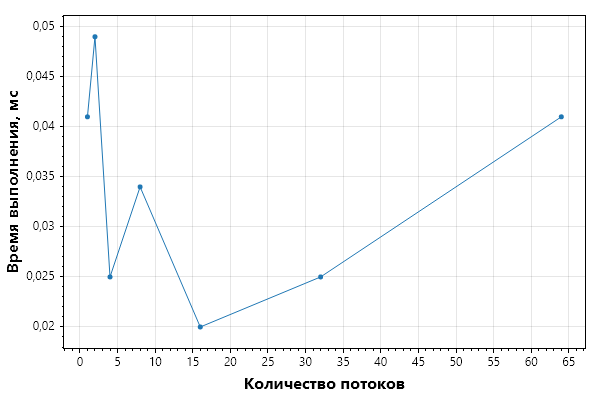

## 1. Время выполнения для разных размеров шага (4 потока)

| Размер шага | Среднее время (мс) | Все замеры (мс) |
| :-- | :-- | :-- |
| 1E-1 | 2.702 | 10.628, 0.098, 0.061, 0.020 |
| 1E-2 | 0.236 | 0.180, 0.264, 0.142, 0.359 |
| 1E-3 | 0.880 | 1.158, 0.817, 0.761, 0.784 |
| 1E-4 | 7.599 | 8.072, 6.962, 6.817, 8.545 |
| 1E-5 | 77.250 | 84.296, 77.360, 74.108, 73.238 |
| 1E-6 | 763.225 | 763.847, 747.019, 775.607, 766.428 |

Наиболее оптимальный шаг 1E-2 со временем 0.236 мс.

## 2. Время выполнения для разного числа потоков

| Кол-во потоков | Среднее время (мс) | Все замеры (мс) |
| :-- | :-- | :-- |
| 1 | 0.041 | 0.043, 0.045, 0.039, 0.038 |
| 2 | 0.049 | 0.091, 0.067, 0.020, 0.016 |
| 4 | 0.025 | 0.037, 0.027, 0.021, 0.016 |
| 8 | 0.034 | 0.074, 0.030, 0.017, 0.014 |
| 16 | 0.020 | 0.028, 0.019, 0.014, 0.018 |
| 32 | 0.025 | 0.037, 0.020, 0.020, 0.024 |
| 64 | 0.041 | 0.061, 0.041, 0.031, 0.031 |

Наиболее оптимальное число потоков: 16 со временем 0.020 мс.

# 3. Дополнительные замеры и сравнение
| Вариант                                | Среднее время (мс) | Все замеры (мс) |
| :-- | :-- | :-- |
| Многопоточный (16 потоков, 4 замера)   | 0.0326 | 0.0294, 0.0393, 0.0289, 0.0327 |
| Однопоточный (нет потоков, 4 замера)   | 0.0392 | 0.0698, 0.0263, 0.0346, 0.0261 |

Многопоточное решение в 1.20 раз быстрее однопоточного.

# 4. График времени выполнения для разного числа потоков
